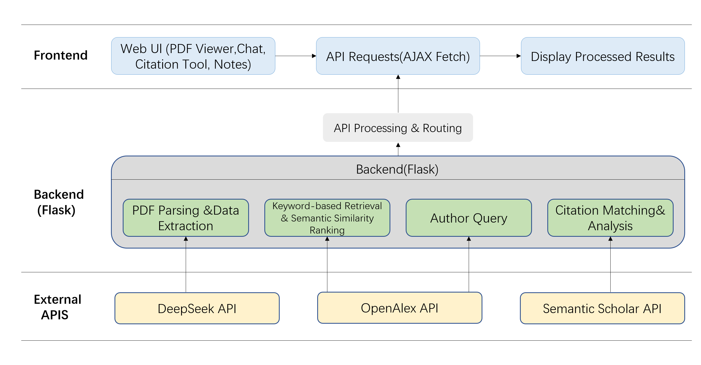

# PaperLens - An AI-powered Paper Reading Assistant for Interactive Scientific Paper Understanding

## Project Overview

PaperLens is a local, AI-powered paper reading assistant designed to support interactive
scientific paper understanding. The system integrates document-grounded comprehension,
scholarly metadata analysis, and contextual literature exploration within a unified
reading environment, enabling users to go beyond linear PDF reading.

PaperLens supports structured interaction with academic papers through PDF upload and
automatic extraction of titles, authors, references, and associated code repositories.
Users can ask document-grounded questions, receive contextual explanations, and explore
related work through semantic similarity and citation relationships. In addition, the
system incorporates scholarly metadata—such as authorship and citation information—to
help situate a paper within its broader academic context.

By combining local paper understanding with global scholarly exploration, PaperLens
reduces the need for frequent tool switching between PDFs, search engines, and citation
databases. The system also provides lightweight workflow support, including note-taking
and access to related resources, facilitating more continuous and structured engagement
with scientific literature.

## System Architecture



_Figure 1: System overview of PaperLens, illustrating frontend–backend interaction
and integration with external scholarly APIs._

PaperLens adopts a modular, layered architecture that separates user interaction,
backend processing, and external scholarly services. The frontend provides a
single-page interface for PDF viewing, chat-based interaction, and note-taking,
while all computational logic is handled by a Flask-based backend. The backend
coordinates document parsing, semantic analysis, citation processing, and author
queries, and integrates external APIs such as DeepSeek, OpenAlex, and Semantic
Scholar to enrich paper understanding and exploration.

## Features and Core Capabilities

PaperLens is designed to support academic paper reading across multiple stages of the
research workflow. It integrates document-grounded understanding, scholarly metadata
analysis, contextual exploration, and lightweight workflow support into a unified,
local system. Specifically, PaperLens provides PDF-based interaction, structured
information extraction, citation analysis, semantic recommendation, and author-level
insights, enabling users to explore a paper beyond linear reading.

The core features and capabilities of PaperLens are summarized below.

| Stage                           | Capability                               | Description                                                                                         |
| ------------------------------- | ---------------------------------------- | --------------------------------------------------------------------------------------------------- |
| **Paper Understanding**         | Document-level dialogue                  | Multi-turn conversational question answering grounded in the uploaded paper                         |
|                                 | Word- and paragraph-level interaction    | Text span selection for translation, explanation, and targeted clarification                        |
|                                 | Automatic summarization                  | Generation of concise summaries capturing the main ideas of a paper                                 |
|                                 | Mind map generation                      | Structured visualization of key concepts and their relationships                                    |
| **Scholarly Metadata Analysis** | Reference verification                   | Semantic validation of reference entries to assess citation authenticity                            |
|                                 | Author profiling and team-level analysis | Aggregation of author affiliations, publication statistics, citation metrics, and team-level impact |
| **Contextual Exploration**      | Citation-based exploration               | Retrieval of papers that cite or are cited by the current document                                  |
|                                 | Semantic recommendation                  | Recommendation of related papers based on semantic content similarity                               |
| **Research Workflow Support**   | Note-taking and annotation               | Persistent user notes and annotations linked to paper content                                       |
|                                 | GitHub repository extraction             | Automatic discovery of code repositories associated with a paper                                    |

## File Structure

The project structure is as follows:

```
PaperLens/
├─ app.py                      # Flask server and API routes
├─ environment.yml             # Conda environment definition
├─ index.html                  # Frontend UI and client-side logic
├─ README.md
├─ modules/
│  ├─ analyze_authors.py        # Author profile aggregation
│  ├─ find_candidate_papers.py  # Recommendation and similarity helpers
│  ├─ find_github_urls.py       # GitHub URL extraction helpers
│  ├─ find_references.py        # Reference extraction helpers
│  ├─ find_title_and_authors.py # Title/author extraction helpers
│  └─ verify_references.py      # Reference verification helpers
└─ user_notes/                  # Local notes storage (created at runtime)

```

## Quick Start

1. Create and activate the environment:
   ```bash
   conda env create -f environment.yml
   conda activate PaperLens
   ```
2. Start the server:
   ```bash
   python app.py
   ```
3. Open the app in your browser:
   ```
   http://localhost:5000
   ```
4. Configure API access

   In the top-right settings panel of the UI, enter your DeepSeek API key.

   - The key is valid only for the current session

   - The key is not written to disk or configuration files

> Note: The "Recommendation of related papers" module relies on external scholarly APIs and may require unrestricted internet access.

## Acknowledgements

This project was developed as a course project for _Introduction to Computer and Software Engineering_, taught by [Prof. Xiaowei Hu](https://xw-hu.github.io/) at [School of Future Technology](https://www2.scut.edu.cn/ft_en/), [South China University of Technology (SCUT)](https://www.scut.edu.cn/en/).

We would like to express our sincere gratitude to Prof. Hu for his guidance, insightful lectures, and constructive feedback throughout the course, which significantly shaped the overall direction and system design of this project.

We also acknowledge the collaborative efforts of our group members:

- Yi Ji
- Haozhou Lang
- Letian Liang

whose contributions, discussions, and teamwork were essential to the successful
completion of this project.

In addition, we would like to acknowledge the open-source libraries and services that made this project possible. We thank the developers and maintainers of [Flask](https://flask.palletsprojects.com/), which provides the lightweight web framework for the backend API, and [PyMuPDF](https://pymupdf.readthedocs.io/), which enables efficient PDF parsing and text extraction. We are also grateful to the contributors of [PyTorch](https://pytorch.org/), [sentence-transformers](https://www.sbert.net/), and [Transformers](https://huggingface.co/docs/transformers), which provide essential foundations for semantic representation and similarity modeling. In addition, this project benefits from public scholarly data services, including [OpenAlex](https://openalex.org/) and [Semantic Scholar](https://www.semanticscholar.org/), for citation and metadata retrieval. Finally, we acknowledge the broader Python open-source ecosystem for providing robust, well-documented tools that support rapid prototyping and research-oriented software development.
